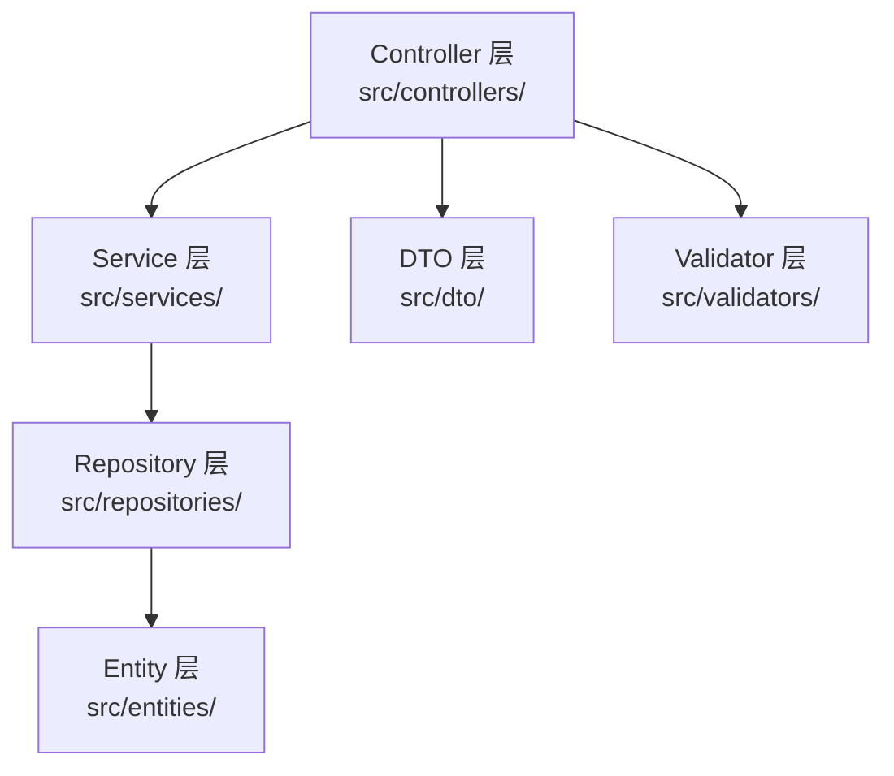

# 增强模块文档生成设计

## 背景

当前 OpenSpec 的 `init` 命令生成的 spec 文件过于简单，缺乏足够的上下文信息，导致 AI 助手在生成代码时容易产生幻觉，生成的提案和任务文档也缺乏明确的实现指引。

**核心问题：**
- AI 无法从现有 spec 准确理解项目的技术实现细节
- 缺少代码结构、模块位置、依赖关系的明确描述
- 生成的 proposal 和 tasks 缺乏可执行的代码实现逻辑
- 数据模型、API 实现、业务规则与实际代码的映射关系不清晰

## 目标

设计一套规范，使 spec 文档成为 AI 理解项目的可靠来源，确保：
1. AI 能通过 spec 准确理解代码结构、实现位置和技术细节
2. 生成的 proposal 包含明确的代码变更指引
3. 生成的 tasks 包含可执行的代码实现步骤和文件路径
4. 避免 AI 幻觉，所有生成的内容都基于 spec 中的事实描述

## 设计原则

- **代码可追溯性**：spec 中的每个功能描述都应映射到具体的代码文件和实现位置
- **实现明确性**：包含足够的技术细节，让 AI 知道"如何实现"而非仅知道"是什么"
- **避免抽象化**：使用具体的文件路径、类名、函数名，而非抽象描述
- **结构化规范**：遵循 OpenSpec 的 `### Requirement` 和 `#### Scenario` 格式
- **分层文档**：项目级、模块级、接口级分层描述，确保上下文完整

## 核心功能需求

### 需求 1：项目级实现上下文文档

初始化流程应当生成包含实现细节的项目上下文文档，让 AI 知道代码的组织方式和实现约定。

**必需内容**

项目文档应当包含以下实现相关信息：

| 文档部分 | 描述内容 | AI 用途 |
|---------|---------|--------|
| 目录结构映射 | 每个目录的职责和命名规则 | 确定新代码的存放位置 |
| 代码组织约定 | 文件命名、模块划分、分层架构 | 生成符合约定的代码结构 |
| 技术实现栈 | 框架、库、工具链及其用法 | 使用正确的 API 和模式 |
| 数据层实现 | ORM/数据库访问方式、实体定义位置 | 生成正确的数据访问代码 |
| API 层实现 | 路由定义、控制器位置、中间件使用 | 生成正确的 API 端点代码 |
| 依赖注入方式 | 如何注册和使用服务、配置管理 | 正确连接各层代码 |

**实现映射表格格式**

项目文档应当包含清晰的实现映射表：

```markdown
## 代码组织结构

### 目录职责映射

| 目录路径 | 职责 | 包含内容 | 命名规则 | 示例 |
|---------|------|---------|---------|------|
| `src/entities/` | 数据实体定义 | TypeORM 实体类 | PascalCase，单数名词 | `User.ts`, `Order.ts` |
| `src/repositories/` | 数据访问层 | Repository 类 | `{Entity}Repository.ts` | `UserRepository.ts` |
| `src/services/` | 业务逻辑层 | Service 类 | `{Domain}Service.ts` | `UserService.ts` |
| `src/controllers/` | API 控制器 | Controller 类 | `{Resource}Controller.ts` | `UserController.ts` |
| `src/dto/` | 数据传输对象 | DTO 类 | `{Action}{Entity}Dto.ts` | `CreateUserDto.ts` |
| `src/validators/` | 输入验证 | Validator 类 | `{Entity}Validator.ts` | `UserValidator.ts` |

### 分层架构实现



**依赖关系规则：**
- Controller 可以依赖 Service、DTO、Validator
- Service 可以依赖 Repository、其他 Service
- Repository 只能依赖 Entity
- 禁止跨层依赖（如 Controller 直接访问 Repository）
```

### 需求 2：模块级实现规范文档

为每个功能模块生成包含实现细节的规范文档，让 AI 知道该模块的代码如何组织和实现。

**模块识别策略**

系统应当支持以下模块识别方式：

| 识别方式 | 描述 | 输出 |
|---------|------|------|
| 代码结构扫描 | 扫描 `src/` 目录，识别按模块组织的代码 | 模块名称、文件列表 |
| 实体类扫描 | 扫描数据实体文件，识别核心业务对象 | 实体名称、字段定义 |
| 路由配置扫描 | 扫描路由定义，识别 API 端点 | 端点路径、HTTP 方法 |
| 交互式补充 | 用户手动补充业务逻辑和实现细节 | 完整的实现规范 |

**模块 spec 实现规范结构**

每个模块的 spec 文件应当包含代码实现的完整上下文（省略具体示例以节省篇幅，实际使用时会包含完整的实体定义、API实现、业务逻辑实现、数据访问实现等详细的代码模式和示例）。

### 需求 3：代码扫描与实现映射

初始化流程应当扫描现有代码，提取实现细节并生成映射关系。

**代码扫描流程**

系统应当：
1. 扫描项目目录结构，识别代码组织模式
2. 检测到分层架构时扫描各层文件
3. 提取实体定义（字段、类型、装饰器）
4. 提取 API 端点（路径、方法、参数）
5. 分析依赖关系，构建依赖关系图
6. 生成实现映射表

**扫描提取内容**

| 提取目标 | 扫描位置 | 提取信息 | 用途 |
|---------|---------|---------|------|
| 实体类 | `src/entities/*.ts` | 类名、字段、类型、装饰器 | 生成数据模型规范 |
| API 路由 | `src/controllers/*.ts` | 路由路径、HTTP 方法、处理器 | 生成 API 接口规范 |
| DTO 定义 | `src/dto/**/*.ts` | 类名、字段、验证器 | 生成请求/响应规范 |
| 服务类 | `src/services/*.ts` | 类名、公共方法签名 | 生成业务逻辑规范 |
| 依赖注入 | 构造函数、装饰器 | 依赖关系图 | 生成模块依赖说明 |

### 需求 4：实现细节提示模板

系统应当在生成的 spec 中嵌入实现细节提示，指导 AI 如何生成代码。

spec 中应当包含明确的实现指引，告诉 AI 如何生成代码，包括代码结构示例、字段定义表、关系定义、索引定义、API 路由装饰器、方法签名、请求 DTO、响应 DTO、实现步骤、业务规则、事务管理等。

### 需求 5：变更提案生成指引

系统应当在 spec 中提供足够的上下文，让 AI 生成的 proposal 包含明确的代码变更指引。

**Proposal 生成要求**

AI 生成的 proposal.md 应当包含：
1. 明确的文件变更清单（新增/修改/删除文件列表）
2. 实现步骤映射（每个步骤对应的文件、内容、参考规范）
3. 代码示例片段（关键实现的代码示例）

### 需求 6：任务文档生成指引

系统应当确保 AI 生成的 tasks.md 包含可执行的具体步骤和文件路径。

**Tasks.md 生成要求**

AI 生成的 tasks.md 应当包含可直接执行的任务清单，每个任务都指定：
- 具体文件路径
- 参考 spec 的哪个部分
- 验证方法（如何确认任务完成）
- 依赖关系（依赖哪些其他任务）

### 需求 7：初始化选项增强

初始化命令应当提供选项来控制 spec 生成的详细程度。

**新增命令行选项**

| 选项 | 简写 | 描述 | 默认值 |
|-----|------|------|--------|
| --with-impl-guide | -g | 生成包含实现指引的详细 spec | false |
| --scan-code | -s | 扫描现有代码提取实现细节 | false |
| --frameworks | -f | 指定使用的框架（如 nestjs,typeorm） | - |

**使用示例**

```bash
# 简单模式（现有行为，仅占位符）
openspec init

# 生成包含实现指引的 spec
openspec init --with-impl-guide

# 扫描现有代码并生成 spec
openspec init --scan-code

# 指定框架，生成框架特定的实现指引
openspec init --with-impl-guide --frameworks nestjs,typeorm
```

**框架支持：**

| 框架 | 生成内容 |
|------|----------|
| nestjs | NestJS 装饰器、依赖注入、模块注册示例 |
| typeorm | TypeORM 实体定义、Repository 模式示例 |
| express | Express 路由、中间件使用示例 |
| prisma | Prisma Schema、查询方法示例 |

## 实现策略

### 阶段 1：增强项目级模板

**目标：** 让 AI 理解项目的代码组织方式

**实现：**
1. 增强 `project-template.ts`，添加：
   - 目录结构映射表（目录 -> 职责 -> 命名规则）
   - 分层架构说明（各层的依赖规则）
   - 框架使用约定（装饰器、依赖注入模式）
   - 文件命名规范（实体、DTO、Service、Controller 的命名模式）

2. 提供框架特定的模板变体：
   - NestJS 项目模板
   - Express 项目模板
   - 通用 TypeScript 项目模板

### 阶段 2：实现代码扫描器

**目标：** 从现有代码中提取实现细节

**实现：**
1. 创建 `src/core/code-scanner.ts`
   - 扫描目录结构，识别分层模式
   - 解析 TypeScript 文件，提取类、方法、装饰器
   - 提取实体定义（字段、类型、装饰器）
   - 提取 API 路由定义（路径、方法、参数）

2. 创建 AST 解析器
   - 使用 TypeScript Compiler API 解析代码
   - 提取类型信息、装饰器元数据
   - 构建依赖关系图

### 阶段 3：实现指引模板生成器

**目标：** 生成包含实现细节的 spec 模板

**实现：**
1. 创建 `src/core/templates/impl-guide-template.ts`
   - 数据模型实现指引模板（包含代码示例）
   - API 实现指引模板（包含路由、Controller 示例）
   - 业务逻辑实现指引模板（包含 Service 模式）
   - 文件路径引用模板

2. 框架特定的代码片段库
   - NestJS 装饰器使用示例
   - TypeORM 实体定义示例
   - Express 路由定义示例

### 阶段 4：Proposal 和 Tasks 生成增强

**目标：** 确保 AI 生成的 proposal 和 tasks 包含实现细节

**实现：**
1. 在 `AGENTS.md` 中添加：
   - Proposal 必须包含的实现细节清单
   - Tasks 必须包含的文件路径和参考规范
   - 代码示例的格式要求

2. 提供 proposal 和 tasks 的示例模板
   - 包含文件变更清单
   - 包含实现步骤和代码示例
   - 包含测试要求

## 数据流设计

### 初始化流程（带实现指引）

系统检测项目使用的框架、扫描代码结构、提取实体和 API 定义、分析依赖关系、使用框架信息和代码元数据渲染模板、生成实现指引内容、填充代码示例，最后用户确认后写入 spec 文件。

### 扫描提取的代码元数据结构

从代码中提取的实现细节应当组织为包含框架信息、目录结构、模块列表等的结构化数据，每个模块包含文件列表、实体定义、API 列表和依赖关系。

## 向后兼容性

该增强设计应当保持向后兼容：
- 默认行为（不带 `--with-impl-guide` 选项）保持不变，生成简单模板
- 现有的简单模板继续可用，不强制用户使用详细模式
- 用户可以选择性地启用实现指引模式
- 不影响已初始化的项目结构和现有 spec 文件
- 对于已存在的项目，可以运行 `openspec init --with-impl-guide` 补充实现指引

## 文件组织

新增的功能应当组织在以下位置：

```
src/
├── core/
│   ├── init.ts                    # 现有初始化逻辑，增强选项处理
│   ├── code-scanner.ts            # 新增：代码扫描器
│   ├── framework-detector.ts      # 新增：框架检测器
│   ├── metadata-extractor.ts      # 新增：元数据提取器
│   ├── templates/
│   │   ├── index.ts               # 现有模板管理
│   │   ├── project-template.ts    # 增强：添加目录映射和代码组织说明
│   │   ├── impl-guide-template.ts # 新增：实现指引模板
│   │   ├── nestjs/                # 新增：NestJS 框架模板
│   │   │   ├── entity-template.ts
│   │   │   ├── controller-template.ts
│   │   │   ├── service-template.ts
│   │   │   └── module-template.ts
│   │   └── express/               # 新增：Express 框架模板
│   │       ├── route-template.ts
│   │       └── model-template.ts
│   └── parsers/                   # 新增：代码解析器
│       ├── typescript-parser.ts   # TypeScript AST 解析
│       ├── decorator-parser.ts    # 装饰器提取
│       └── entity-parser.ts       # 实体定义提取
```

## 用户体验考虑

### 智能扫描反馈

- 显示扫描进度：正在扫描的目录和文件
- 显示识别到的框架和模式
- 提供扫描结果摘要（发现了多少实体、多少 API 端点）

### 实现指引预览

- 在生成前展示将要创建的 spec 文件列表
- 提供关键内容预览（如实体定义、API 端点）
- 允许用户选择性排除某些模块

### 增量更新支持

- 支持在已有 spec 的基础上补充实现指引
- 不覆盖用户手动添加的内容
- 提供 diff 预览，显示将要添加的内容

## 示例输出

### 包含实现指引的 project.md

生成的项目文档会包含完整的代码组织结构映射、分层架构实现说明、框架使用约定、文件命名规范等，为 AI 提供完整的实现上下文。

## 风险和权衡

### 代码扫描准确性
- **风险**：不同项目的代码组织方式差异较大，扫描可能不准确
- **缓解**：提供多种组织模式的检测；允许用户手动调整扫描结果；提供扫描报告让用户确认

### 框架支持范围
- **风险**：无法支持所有框架和 ORM
- **缓解**：优先支持主流框架（NestJS, Express）；提供通用模板作为后备；设计可扩展的框架插件机制

### 维护同步
- **风险**：代码变更后，spec 中的实现指引可能过时
- **缓解**：在 spec 中明确标注这是"初始化时的实现指引"；鼓励 AI 在实现时验证当前代码结构；支持重新扫描更新

### 学习曲线
- **风险**：包含实现细节的 spec 更复杂，用户需要时间适应
- **缓解**：提供清晰的文档和示例；保持简单模式为默认选项；渐进式引入功能

## 开放问题

1. 是否需要支持从 OpenAPI/Swagger 文档导入 API 定义？
2. 如何处理多数据库项目（如同时使用 PostgreSQL 和 MongoDB）？
3. 是否需要支持前端框架的代码扫描（如 React, Vue）？
4. 如何确保扫描提取的信息与实际代码保持同步？
5. 是否需要提供 spec 内容的验证工具，确保实现指引的准确性？
