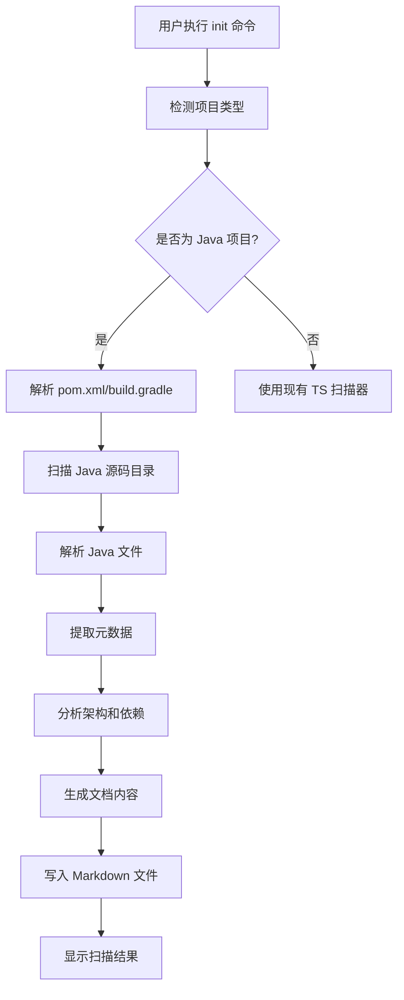
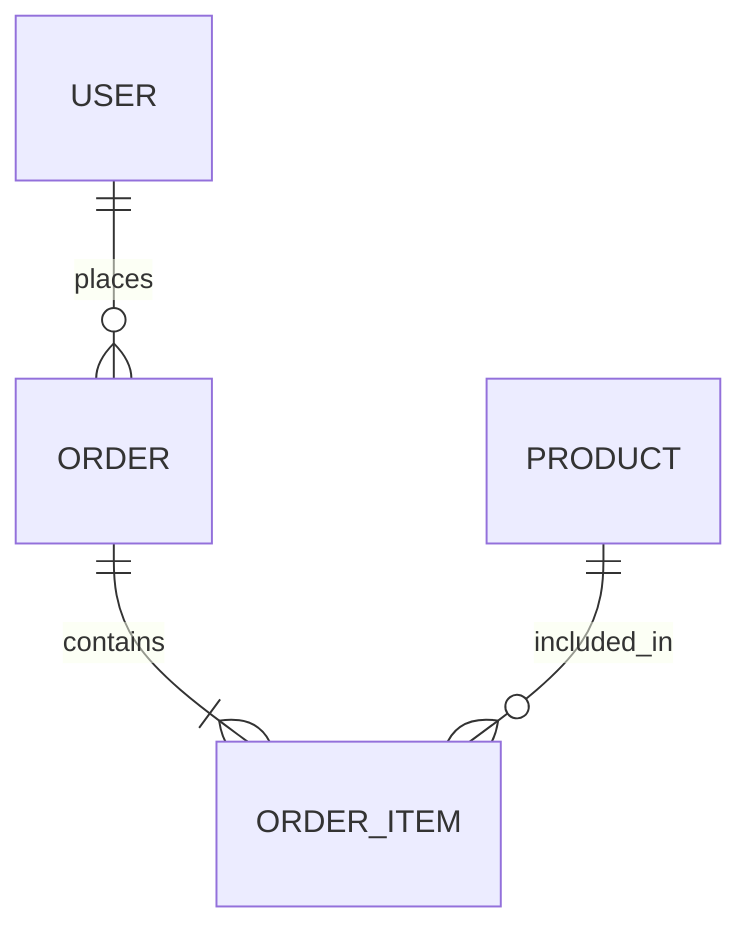

# Java/Spring Boot 深度代码扫描与项目文档生成功能设计

## 功能概述

为 OpenSpec 的 `init` 命令扩展 Java/Spring Boot 项目支持,实现深度代码扫描并自动生成包含业务逻辑、API 说明、代码规范、类和字段说明的项目文档,帮助 AI 快速理解项目结构,减少幻觉,提高代码质量。

## 业务价值

### 核心问题
当前 AI 辅助编程面临的主要挑战:
- AI 对现有 Java 项目缺乏深入理解,容易产生不符合项目规范的代码
- 手动编写项目文档耗时耗力,且难以保持更新
- 大型 Java 项目复杂度高,AI 难以准确把握分层架构和依赖关系
- 缺少业务逻辑和 API 上下文,AI 生成的代码容易出现业务逻辑错误

### 解决方案价值
- **减少 AI 幻觉**: 通过提供准确的项目上下文,使 AI 生成的代码符合项目规范
- **提高开发效率**: 自动生成的文档让 AI 快速理解项目,减少人工解释成本
- **保证代码质量**: 明确的架构和规范约束,确保生成代码的一致性
- **降低维护成本**: 代码变更时可重新扫描更新文档,保持文档与代码同步

## 功能需求

### 需求 1: Java 项目识别与框架检测

系统应能够自动识别 Java 项目并检测使用的框架和技术栈。

#### 场景: 检测 Spring Boot 项目
- **当** 用户在 Java/Spring Boot 项目目录执行 `openspec init --scan-code`
- **则** 扫描 `pom.xml` 或 `build.gradle` 文件
- **并且** 识别出 Spring Boot、Spring Web、Spring Data JPA、MyBatis 等框架
- **并且** 提取 Java 版本、Spring Boot 版本等关键信息
- **并且** 识别数据库技术(MySQL、PostgreSQL、MongoDB 等)

#### 场景: 检测 Maven 项目结构
- **当** 系统检测到 `pom.xml` 文件
- **则** 解析 Maven 依赖配置
- **并且** 提取 `<dependencies>` 和 `<plugins>` 信息
- **并且** 识别项目模块结构(单模块或多模块)

#### 场景: 检测 Gradle 项目结构
- **当** 系统检测到 `build.gradle` 或 `build.gradle.kts` 文件
- **则** 解析 Gradle 依赖配置
- **并且** 提取 dependencies 和 plugins 信息
- **并且** 支持 Groovy 和 Kotlin DSL 两种语法

### 需求 2: Java 代码深度扫描

系统应能够深度扫描 Java 源代码,提取关键元数据。

#### 场景: 扫描实体类(Entity)
- **当** 扫描到带有 `@Entity`、`@Table` 等注解的 Java 类
- **则** 提取类名、表名、包路径
- **并且** 提取所有字段的名称、类型、注解(如 `@Column`、`@Id`、`@GeneratedValue`)
- **并且** 识别字段约束(nullable、unique、length 等)
- **并且** 提取实体关系注解(`@OneToMany`、`@ManyToOne`、`@ManyToMany`、`@OneToOne`)
- **并且** 记录关系的级联类型和懒加载配置

#### 场景: 扫描 Controller 层
- **当** 扫描到带有 `@RestController` 或 `@Controller` 注解的类
- **则** 提取控制器名称、基础路径(`@RequestMapping` 值)
- **并且** 提取所有接口方法的信息:
  - HTTP 方法(`@GetMapping`、`@PostMapping`、`@PutMapping`、`@DeleteMapping`、`@PatchMapping`)
  - 路由路径
  - 请求参数(`@RequestParam`、`@PathVariable`、`@RequestBody`)
  - 响应类型(方法返回值)
  - 方法注释(JavaDoc)
- **并且** 识别权限注解(如 `@PreAuthorize`、`@Secured`)

#### 场景: 扫描 Service 层
- **当** 扫描到带有 `@Service` 注解的类
- **则** 提取服务类名称、包路径
- **并且** 提取所有业务方法:
  - 方法名称
  - 参数列表(类型和名称)
  - 返回值类型
  - 方法注释
- **并且** 识别事务注解(`@Transactional` 及其配置)
- **并且** 提取依赖注入的其他服务(构造器注入或字段注入)

#### 场景: 扫描 Repository 层
- **当** 扫描到继承 `JpaRepository`、`CrudRepository` 或带 `@Repository` 注解的接口
- **则** 提取 Repository 接口名称
- **并且** 识别泛型参数(实体类型和主键类型)
- **并且** 提取自定义查询方法
- **并且** 识别 `@Query` 注解中的 JPQL 或原生 SQL

#### 场景: 扫描 DTO 类
- **当** 扫描到位于 `dto`、`vo` 或 `request/response` 包下的类
- **则** 提取类名、包路径
- **并且** 提取所有字段及其类型
- **并且** 识别验证注解(`@NotNull`、`@NotBlank`、`@Size`、`@Email` 等)
- **并且** 提取 Lombok 注解(`@Data`、`@Getter`、`@Setter`、`@Builder` 等)

### 需求 3: 项目架构分析

系统应能够分析 Java 项目的分层架构和目录组织规范。

#### 场景: 识别标准分层架构
- **当** 扫描项目目录结构
- **则** 识别以下标准分层:
  - Controller/Web 层
  - Service/Business 层
  - Repository/DAO/Mapper 层
  - Entity/Model/Domain 层
  - DTO/VO 层
  - Config 配置层
  - Exception 异常处理层
  - Util/Common 工具层

#### 场景: 分析包组织模式
- **当** 分析 Java 包结构
- **则** 识别项目使用的组织模式:
  - 按层划分(controller、service、repository 包)
  - 按模块划分(user、order、product 模块,每个模块内分层)
  - 混合模式
- **并且** 记录每种模式的优缺点和适用场景

#### 场景: 识别依赖关系
- **当** 分析类之间的依赖
- **则** 构建依赖关系图:
  - Controller 依赖哪些 Service
  - Service 依赖哪些 Repository
  - Service 之间的相互依赖
- **并且** 检测是否存在循环依赖
- **并且** 标记违反分层原则的依赖(如 Controller 直接调用 Repository)

### 需求 4: 业务逻辑提取

系统应能够从代码注释和方法实现中提取业务逻辑说明。

#### 场景: 提取 JavaDoc 注释
- **当** 扫描 Java 类和方法
- **则** 提取类级别的 JavaDoc 注释
- **并且** 提取方法级别的 JavaDoc 注释
- **并且** 解析 `@param`、`@return`、`@throws` 等标签
- **并且** 保留业务逻辑描述部分

#### 场景: 提取关键业务流程
- **当** 分析 Service 层方法实现
- **则** 识别关键业务步骤(通过代码注释或方法调用链)
- **并且** 提取以下信息:
  - 数据验证逻辑
  - 业务规则检查
  - 外部服务调用
  - 数据库操作序列
  - 事务边界

#### 场景: 识别业务异常处理
- **当** 扫描异常处理代码
- **则** 提取自定义异常类及其说明
- **并且** 识别全局异常处理器(`@ControllerAdvice`)
- **并且** 记录异常与业务场景的映射关系

### 需求 5: API 文档生成

系统应自动生成完整的 API 接口文档。

#### 场景: 生成 RESTful API 清单
- **当** 扫描完成后生成文档
- **则** 创建 API 接口清单表格,包含:
  - HTTP 方法
  - 接口路径
  - 功能描述
  - 请求参数
  - 响应格式
  - 认证要求

#### 场景: 生成请求响应示例
- **当** 识别到 DTO 类
- **则** 基于字段类型和验证注解生成请求示例
- **并且** 生成响应数据结构示例
- **并且** 标注必填字段和可选字段

### 需求 6: 数据模型文档生成

系统应生成完整的数据模型文档。

#### 场景: 生成实体关系图描述
- **当** 扫描完所有实体类
- **则** 生成实体关系描述:
  - 实体名称与表名映射
  - 字段清单(名称、类型、约束、说明)
  - 实体间关系(一对多、多对一、多对多)
- **并且** 使用 Mermaid 图表表示实体关系

#### 场景: 生成字段详细说明表
- **当** 生成实体文档
- **则** 为每个实体创建字段说明表:

| 字段名 | Java 类型 | 数据库类型 | 约束 | 说明 |
|--------|-----------|------------|------|------|
| id | Long | BIGINT | 主键,自增 | 用户唯一标识 |
| username | String | VARCHAR(50) | 非空,唯一 | 用户名 |
| email | String | VARCHAR(100) | 非空,唯一 | 邮箱地址 |

### 需求 7: 代码规范文档生成

系统应基于扫描结果推断并生成代码规范文档。

#### 场景: 识别命名规范
- **当** 分析代码库中的命名
- **则** 识别以下命名规范:
  - 类命名模式(如 `UserService`、`UserController`)
  - 方法命名模式(如 `findById`、`createUser`)
  - 变量命名风格(驼峰命名)
  - 常量命名风格(全大写下划线分隔)
- **并且** 生成命名规范示例

#### 场景: 识别注解使用规范
- **当** 统计注解使用情况
- **则** 总结常用注解及其使用场景:
  - Spring 核心注解(`@Component`、`@Service`、`@Repository`)
  - Web 层注解(`@RestController`、`@RequestMapping`)
  - 数据层注解(`@Entity`、`@Table`、`@Column`)
  - 验证注解(`@Valid`、`@NotNull`)
- **并且** 提供使用示例

#### 场景: 识别异常处理规范
- **当** 分析异常处理代码
- **则** 总结异常处理模式:
  - 自定义异常体系
  - 全局异常处理器
  - 错误码定义规范
  - 异常信息国际化

### 需求 8: Markdown 文档输出

系统应生成结构化的 Markdown 项目文档。

#### 场景: 生成完整项目文档
- **当** 执行 `openspec init --scan-code` 完成
- **则** 在 `openspec/project.md` 生成完整文档,包含:
  - 项目概览(名称、描述、技术栈)
  - 架构设计(分层结构、依赖关系)
  - 目录结构说明
  - API 接口文档
  - 数据模型文档
  - 代码规范
  - 业务逻辑说明

#### 场景: 模块化文档结构
- **当** 项目采用模块化组织(如 DDD 或按业务模块划分)
- **则** 为每个模块生成独立的文档:
  - `openspec/modules/user-module.md`
  - `openspec/modules/order-module.md`
- **并且** 在主文档中链接各模块文档

### 需求 9: 扫描进度与结果展示

系统应提供友好的扫描进度反馈。

#### 场景: 显示扫描进度
- **当** 执行代码扫描
- **则** 实时显示扫描进度:
  - 正在扫描的目录
  - 已扫描文件数量
  - 发现的实体、Controller、Service 数量
- **并且** 使用进度条或动画提示

#### 场景: 展示扫描结果摘要
- **当** 扫描完成
- **则** 显示扫描结果统计:
  - 检测到的框架和版本
  - 代码组织模式
  - 实体数量、API 数量、服务数量
  - 代码行数统计
- **并且** 允许用户预览和确认扫描结果

### 需求 10: 增量更新支持

系统应支持增量更新已生成的项目文档。

#### 场景: 重新扫描更新文档
- **当** 用户在已初始化的项目中执行 `openspec init --scan-code --update`
- **则** 重新扫描代码库
- **并且** 对比现有文档,标记变更部分
- **并且** 更新文档内容,保留用户手动添加的部分

## 技术设计

### 架构组件

系统采用分层架构,包含以下核心组件:

```
CLI 层 (src/cli/index.ts)
    ↓
Init 命令 (src/core/init.ts)
    ↓
Java 框架检测器 (src/core/framework-detector-java.ts)
    ↓
Java 代码扫描器 (src/core/code-scanner-java.ts)
    ↓
Java AST 解析器 (src/core/parsers/java-parser.ts)
    ↓
文档生成器 (src/core/templates/java-project-template.ts)
    ↓
文件系统 (src/utils/file-system.ts)
```

### 数据流

扫描和文档生成的数据流程:



### Java 项目检测策略

识别 Java 项目的决策流程:

| 检测项 | 检测方法 | 优先级 |
|--------|----------|--------|
| Maven 项目 | 检查 `pom.xml` 是否存在 | 高 |
| Gradle 项目 | 检查 `build.gradle` 或 `build.gradle.kts` | 高 |
| Java 源码目录 | 检查 `src/main/java` 目录 | 中 |
| Spring Boot 项目 | 检查主类 `@SpringBootApplication` 注解 | 中 |
| 包结构 | 检查是否有 `com/`、`org/` 等包前缀 | 低 |

### 依赖解析器设计

Maven 依赖解析器:

| 解析内容 | XML 路径 | 提取信息 |
|----------|----------|----------|
| 项目基本信息 | `/project/groupId`、`/project/artifactId` | 项目坐标 |
| Java 版本 | `/project/properties/java.version` | Java 版本 |
| Spring Boot 版本 | `/project/parent/version` (parent 是 spring-boot-starter-parent) | Spring Boot 版本 |
| 依赖列表 | `/project/dependencies/dependency` | 框架和库清单 |
| 插件列表 | `/project/build/plugins/plugin` | 构建工具配置 |

Gradle 依赖解析器:

| 解析内容 | DSL 语法 | 提取信息 |
|----------|----------|----------|
| 插件 | `plugins { id 'xxx' version 'yyy' }` | 使用的 Gradle 插件 |
| Java 版本 | `sourceCompatibility = '17'` | Java 版本 |
| 依赖 | `implementation 'group:artifact:version'` | 框架和库清单 |
| Spring Boot 依赖 | `implementation 'org.springframework.boot:spring-boot-starter-web'` | Spring Boot 模块 |

### Java AST 解析策略

由于 Java 是静态类型语言,无法直接使用 JavaScript/TypeScript AST 解析器。系统采用以下方案:

**方案选择: 正则表达式 + 文本解析**

对于初版实现,使用正则表达式和文本解析提取关键信息:

| 解析目标 | 解析方法 | 示例正则 |
|----------|----------|----------|
| 类注解 | 匹配 `@AnnotationName` 后跟类定义 | `@(Entity\|Service\|Controller\|Repository).*?class\s+(\w+)` |
| 类名 | 匹配 `public class ClassName` | `public\s+class\s+(\w+)` |
| 字段定义 | 匹配字段注解和声明 | `@Column.*?private\s+(\w+)\s+(\w+);` |
| 方法定义 | 匹配访问修饰符、返回类型、方法名、参数 | `public\s+(\w+)\s+(\w+)\((.*?)\)` |
| 注解参数 | 匹配注解括号内的参数 | `@RequestMapping\("(.*?)"\)` |
| JavaDoc | 匹配 `/** ... */` 块 | `/\*\*(.*?)\*/` |

**未来优化方案**

后续版本可考虑以下更强大的解析方案:

- 使用 Java Parser 库(如 JavaParser):需要通过 Node.js 子进程调用 Java 程序
- 使用 Tree-sitter:支持多语言的增量解析器
- 集成 Language Server Protocol (LSP):获取更准确的类型和引用信息

### 扫描范围与性能优化

针对大型 Java 项目的性能优化策略:

| 优化项 | 策略 | 预期效果 |
|--------|------|----------|
| 排除目录 | 默认排除 `target/`、`build/`、`.git/`、`node_modules/` | 减少 80% 无效扫描 |
| 并行扫描 | 使用 Worker Threads 并行处理多个文件 | 扫描速度提升 3-4 倍 |
| 增量扫描 | 缓存扫描结果,仅扫描变更文件 | 重复扫描提速 90% |
| 深度限制 | 默认最大扫描深度 10 层 | 避免深层嵌套导致的性能问题 |
| 大文件跳过 | 跳过超过 1MB 的单个 Java 文件 | 避免扫描自动生成的大文件 |
| 缓存解析结果 | 将 pom.xml/build.gradle 解析结果缓存 | 避免重复解析 |

### 文档模板设计

生成的 `project.md` 文档结构:

```
# [项目名称] 项目文档

## 项目概览
- 项目名称
- 项目描述
- 技术栈摘要
- Java 版本、Spring Boot 版本

## 技术栈详情
- 核心框架(Spring Boot、Spring Web、Spring Data JPA)
- 数据库(MySQL、Redis)
- 第三方库(Lombok、MapStruct、Hutool)
- 构建工具(Maven/Gradle)

## 项目架构

### 分层架构
- Controller 层职责
- Service 层职责
- Repository 层职责
- Entity 层职责

### 包组织结构
- 包组织模式(按层/按模块)
- 包命名规范
- 模块划分说明

### 依赖关系图
使用 Mermaid 图表展示主要依赖关系

## 目录结构说明
| 目录路径 | 用途 | 职责说明 |
|---------|------|---------|
| src/main/java/com/xxx/controller | 控制器层 | 处理 HTTP 请求,参数验证,响应封装 |
| src/main/java/com/xxx/service | 服务层 | 业务逻辑实现,事务管理 |
| ... | ... | ... |

## API 接口文档

### 用户管理接口
| 接口路径 | HTTP 方法 | 功能说明 | 请求参数 | 响应格式 |
|---------|----------|---------|---------|---------|
| /api/users | GET | 获取用户列表 | page, size | Page<UserVO> |
| /api/users/{id} | GET | 获取用户详情 | id(路径参数) | UserVO |
| ... | ... | ... | ... | ... |

### 订单管理接口
...

## 数据模型文档

### 实体关系图


### User 实体
**表名**: `t_user`

| 字段名 | Java 类型 | 数据库类型 | 约束 | 说明 |
|--------|-----------|------------|------|------|
| id | Long | BIGINT | 主键,自增 | 用户ID |
| username | String | VARCHAR(50) | 非空,唯一 | 用户名 |
| ... | ... | ... | ... | ... |

**关联关系**:
- 一对多: User -> Order (一个用户可以有多个订单)

### Order 实体
...

## 业务逻辑说明

### 用户注册流程
1. 验证用户名和邮箱是否重复
2. 密码加密存储
3. 创建用户记录
4. 发送欢迎邮件

### 订单创建流程
1. 验证用户身份
2. 检查库存
3. 计算订单金额
4. 创建订单记录
5. 扣减库存
6. 发送订单通知

## 代码规范

### 命名规范
- 类名:大驼峰,如 `UserService`
- 方法名:小驼峰,如 `findUserById`
- 常量:全大写下划线分隔,如 `MAX_RETRY_COUNT`
- 包名:全小写,如 `com.example.user.service`

### 注解使用规范
- Controller 层使用 `@RestController` 和 `@RequestMapping`
- Service 层使用 `@Service` 和 `@Transactional`
- Repository 层继承 `JpaRepository` 或使用 `@Repository`
- Entity 层使用 `@Entity`、`@Table`、`@Column`

### 异常处理规范
- 使用自定义业务异常继承 `RuntimeException`
- 全局异常处理器使用 `@ControllerAdvice`
- 错误码定义在 `ErrorCode` 枚举中

### 事务管理规范
- 事务注解添加在 Service 层方法上
- 只读操作使用 `@Transactional(readOnly = true)`
- 需要回滚的异常在 `rollbackFor` 中声明

## 常用工具类
- DateUtil: 日期时间处理
- ValidationUtil: 数据验证
- JsonUtil: JSON 序列化/反序列化

## 配置说明
- 数据库连接配置
- Redis 配置
- 日志配置
- 跨域配置
```

### 配置选项设计

扩展 `init` 命令的选项:

| 选项 | 简写 | 说明 | 默认值 |
|------|------|------|--------|
| `--scan-code` | `-s` | 启用代码扫描 | false |
| `--with-impl-guide` | `-g` | 生成实现指引 | false |
| `--frameworks <list>` | `-f` | 手动指定框架 | 自动检测 |
| `--max-depth <n>` | 无 | 最大扫描深度 | 10 |
| `--update` | `-u` | 更新现有文档 | false |
| `--include <patterns>` | `-i` | 额外包含的文件模式 | 无 |
| `--exclude <patterns>` | `-e` | 额外排除的文件模式 | 无 |

使用示例:
```bash
# 基础扫描
openspec init --scan-code

# 扫描并生成实现指引
openspec init --scan-code --with-impl-guide

# 手动指定框架
openspec init --scan-code --frameworks springboot,mybatis,redis

# 更新已有文档
openspec init --scan-code --update

# 自定义扫描深度
openspec init --scan-code --max-depth 15
```

## 风险与约束

### 技术风险

| 风险项 | 影响 | 缓解措施 |
|--------|------|----------|
| Java 解析不准确 | 提取的元数据可能不完整 | 使用多种解析策略组合,提供手动修正机制 |
| 大型项目扫描超时 | 用户体验差 | 实现进度展示、支持后台扫描、增量更新 |
| 多模块项目支持 | Maven/Gradle 多模块结构复杂 | 递归扫描子模块,生成独立文档 |
| 非标准项目结构 | 无法准确识别分层 | 提供配置文件自定义扫描规则 |
| 中文注释乱码 | 文档显示异常 | 自动检测文件编码(UTF-8、GBK) |

### 性能约束

| 约束项 | 限制 | 原因 |
|--------|------|------|
| 单次扫描文件数 | < 10,000 文件 | 避免内存溢出 |
| 单个文件大小 | < 1 MB | 跳过自动生成的大文件 |
| 扫描超时 | 5 分钟 | 避免长时间阻塞 |
| 并发解析任务数 | CPU 核心数 | 平衡性能和资源占用 |

### 兼容性约束

| 约束项 | 支持范围 | 说明 |
|--------|----------|------|
| Java 版本 | Java 8+ | 覆盖主流 Java 版本 |
| Spring Boot 版本 | 2.x、3.x | 支持当前广泛使用的版本 |
| Maven 版本 | 3.x | 标准 Maven 项目 |
| Gradle 版本 | 6.x、7.x、8.x | 支持 Groovy 和 Kotlin DSL |
| 字符编码 | UTF-8、GBK | 自动检测和转换 |

## 实施策略

### 开发阶段划分

#### 阶段 1: 基础设施(预计 3-4 天)
- 创建 Java 框架检测器
- 实现 Maven pom.xml 解析
- 实现 Gradle build.gradle 解析
- 添加 Java 项目识别逻辑

#### 阶段 2: 代码扫描器(预计 5-6 天)
- 创建 Java 代码扫描器主类
- 实现目录遍历和文件过滤
- 实现注解提取(正则表达式方案)
- 实现实体类元数据提取
- 实现 Controller 层扫描
- 实现 Service 层扫描
- 实现 Repository 层扫描
- 实现 DTO 类扫描

#### 阶段 3: 架构分析(预计 3-4 天)
- 实现包结构分析
- 实现分层架构识别
- 实现依赖关系分析
- 实现业务逻辑提取(JavaDoc)

#### 阶段 4: 文档生成(预计 4-5 天)
- 创建 Java 项目文档模板
- 实现 API 接口文档生成
- 实现数据模型文档生成
- 实现代码规范文档生成
- 实现 Mermaid 图表生成

#### 阶段 5: 集成与优化(预计 3-4 天)
- 集成到 init 命令
- 实现进度展示
- 实现增量更新
- 性能优化(并行扫描)
- 错误处理完善

#### 阶段 6: 测试与文档(预计 3-4 天)
- 编写单元测试
- 编写集成测试
- 使用真实 Spring Boot 项目测试
- 编写用户文档
- 更新 AGENTS.md 说明

**总预计时间**: 21-27 天

### 渐进式交付

为降低风险,采用渐进式交付策略:

**MVP (最小可行产品) - 第 1 周**
- 支持 Maven 项目识别
- 扫描 Entity、Controller、Service 三层
- 生成基础项目文档(架构、目录、API 清单)

**第 2 次迭代 - 第 2 周**
- 增加 Gradle 项目支持
- 增加 Repository 和 DTO 扫描
- 完善 API 接口文档(请求/响应示例)
- 生成数据模型文档

**第 3 次迭代 - 第 3 周**
- 增加业务逻辑提取
- 生成代码规范文档
- 实现依赖关系分析
- 支持 Mermaid 图表

**最终版本 - 第 4 周**
- 性能优化(并行扫描、增量更新)
- 支持多模块项目
- 完善错误处理
- 完整测试覆盖

### 测试策略

| 测试类型 | 测试内容 | 覆盖目标 |
|----------|----------|----------|
| 单元测试 | 框架检测器、解析器、扫描器各组件 | 代码覆盖率 > 80% |
| 集成测试 | Init 命令端到端流程 | 主要场景覆盖 |
| 真实项目测试 | 使用开源 Spring Boot 项目测试 | 验证实际效果 |
| 性能测试 | 大型项目扫描速度 | 10,000 文件 < 2 分钟 |
| 兼容性测试 | 不同 Java/Spring Boot 版本 | 支持主流版本 |

测试用例库:
- 小型项目: Spring Boot Starter 示例项目(< 50 个 Java 文件)
- 中型项目: Spring Pet Clinic(约 200 个 Java 文件)
- 大型项目: 内部业务系统或开源项目(> 1000 个 Java 文件)

## 成功指标

### 功能完整性指标

| 指标 | 目标值 | 验收标准 |
|------|--------|----------|
| 框架识别准确率 | > 95% | 正确识别 Spring Boot、MyBatis 等主流框架 |
| 实体扫描完整率 | > 90% | 扫描到所有标准 `@Entity` 类 |
| API 扫描完整率 | > 90% | 扫描到所有 `@RestController` 接口 |
| 文档生成成功率 | 100% | 所有扫描成功的项目都能生成文档 |

### 质量指标

| 指标 | 目标值 | 验收标准 |
|------|--------|----------|
| AI 幻觉减少 | > 60% | 使用文档后,AI 生成符合规范的代码比例提升 |
| 文档准确性 | > 85% | 生成的文档与实际代码一致 |
| 用户满意度 | > 4/5 分 | 用户反馈评分 |

### 性能指标

| 指标 | 目标值 | 验收标准 |
|------|--------|----------|
| 小型项目扫描 | < 10 秒 | < 100 个 Java 文件 |
| 中型项目扫描 | < 1 分钟 | 100-500 个 Java 文件 |
| 大型项目扫描 | < 5 分钟 | 500-5000 个 Java 文件 |
| 内存占用 | < 500 MB | 扫描 1000 个文件时 |
| 增量更新速度 | < 10 秒 | 仅更新变更部分 |

## 后续演进

### 短期优化(1-3 个月)

- **MyBatis XML 映射文件解析**: 提取 SQL 语句和参数映射
- **Spring 配置文件解析**: 提取 application.yml 中的关键配置
- **Swagger/OpenAPI 集成**: 如果项目已有 Swagger 注解,直接提取
- **异常处理链路追踪**: 分析异常传播路径

### 中期扩展(3-6 个月)

- **使用 JavaParser 提升准确性**: 替换正则表达式,使用真正的 Java AST 解析
- **支持 Kotlin 项目**: 扫描 Spring Boot + Kotlin 项目
- **支持微服务架构**: 识别服务间调用关系(Feign、RestTemplate)
- **数据库逆向工程**: 从数据库表结构生成实体文档

### 长期愿景(6-12 个月)

- **AI 辅助文档补全**: 使用 AI 自动填充业务逻辑说明
- **代码质量分析**: 检测代码坏味道,给出改进建议
- **自动生成测试用例**: 基于业务逻辑生成单元测试框架
- **多语言支持**: 扩展到 Python、Go、C# 等其他后端语言
